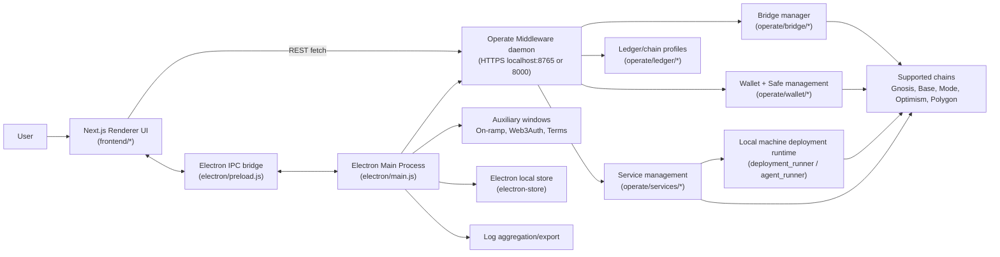

# Pearl Architecture

This document explains how Pearl is structured across repositories, what features it supports, and where each part of the logic lives.

## Repositories and responsibilities

Pearl is split across two repositories:

- `olas-operate-app` (desktop product)
  - Electron main process (desktop lifecycle, process orchestration, native integrations)
  - Next.js renderer UI (user flows, state management, API clients)
  - Packaging/build scripts and bundled middleware binaries
- `olas-operate-middleware` (backend daemon)
  - FastAPI HTTP server exposing `/api` and `/api/v2`
  - Wallet, service lifecycle, funding, bridge, recovery, and blockchain integrations

In production, the desktop app launches a bundled middleware binary; in development it launches `operate daemon` via Poetry.

---

## High-level runtime architecture

---

## Layer-by-layer design

## 1) Electron layer (`olas-operate-app/electron`)

Primary owner: desktop runtime concerns.

- App lifecycle and single-instance lock.
- Creates splash window, main window, tray icon, and auxiliary windows.
- Generates/loads local TLS certs for secure localhost backend communication.
- Starts/stops backend daemon and frontend server.
- Exposes safe IPC APIs to renderer through `contextBridge`.
- Provides native capabilities:
  - notifications
  - app version
  - open file paths
  - persistent desktop store access
  - log export for debug/support
  - on-ramp/Web3Auth/terms windows

Key files:

- `electron/main.js`: boot orchestration, process management, IPC handlers
- `electron/preload.js`: IPC surface exposed as `window.electronAPI`
- `electron/store.js`: electron-store schema + migrations + change notifications
- `electron/features/logs.js`: sanitized log bundles + support file generation
- `electron/components/PearlTray.js`: tray status, click behavior, menu
- `electron/windows/*`: Web3Auth, swap-owner, terms window management

## 2) Frontend layer (`olas-operate-app/frontend`)

Primary owner: user journeys, state, and API integration.

- Next.js renderer with Ant Design + React Query + context providers.
- Two main app modes:
  - `Setup`: onboarding/recovery/funding flows
  - `Main`: day-to-day agent and wallet operations
- Page state machine via constants (`PAGES`, `SETUP_SCREEN`) and providers.
- Fetch-based service modules calling middleware endpoints (`/api`, `/api/v2`).
- Consumes Electron APIs through `ElectronApiProvider` and hooks.

Key files:

- `frontend/pages/index.tsx`: selects Setup vs Main
- `frontend/components/SetupPage/index.tsx`: setup state machine screens
- `frontend/components/MainPageV1/index.tsx`: main application screen routing
- `frontend/components/MainPageV1/Sidebar/Sidebar.tsx`: navigation and agent selection
- `frontend/service/*.ts`: backend API clients by domain

## 3) Middleware layer (`olas-operate-middleware/operate`)

Primary owner: domain logic and blockchain operations.

- `operate/cli.py` hosts FastAPI app and endpoint handlers.
- Operates on local data directory (`.operate`) for user/wallet/service state.
- Modules by domain:
  - account authentication and password management
  - wallet + master safe orchestration
  - service lifecycle and deployment
  - funding requirements and funding execution
  - bridge execution and tracking
  - recovery preparation/completion and status
  - achievement and performance retrieval

Important internal modules:

- `operate/services/`: service manager, runners, health/funding helpers
- `operate/wallet/`: master wallet manager and recovery manager
- `operate/bridge/`: bridge manager + providers
- `operate/ledger/`: chain profiles/config
- `docs/api.md`: full API contract

---

## Feature map (what Pearl supports)

The following features are currently represented in Pearl UI and middleware APIs.

### Account & authentication

- Check account setup state.
- Create account with password.
- Login with password.
- Update password:
  - old password path
  - seed phrase (mnemonic) recovery path

Frontend: `frontend/service/Account.ts`  
Backend: `/api/account`, `/api/account/login`

### Wallet & Safe management

- Create/load master EOA wallet.
- Fetch wallet list and extended wallet view.
- Create master safe on a target chain.
- Configure or update backup safe owner.
- Retrieve mnemonic (seed phrase) by password.
- Withdraw funds to an external target (safe-first with EOA fallback).

Frontend: `frontend/service/Wallet.ts`  
Backend: `/api/wallet*`, `/api/wallet/safe*`, `/api/wallet/withdraw`

### Recovery flows

- Recovery status inspection.
- Recovery funding requirements.
- Recovery preparation (new password).
- Recovery completion.
- Web3Auth-based safe owner swap flow (desktop popup + UI callback events).

Frontend: `frontend/service/Recovery.ts`, `pages/web3auth-swap-owner.tsx`  
Electron: `electron/windows/web3authSwapOwner.js`  
Backend: `/api/wallet/recovery/*`

### Agent/service lifecycle

- List services and fetch individual service.
- Validate service configurations.
- Create service (template + chain-specific configuration).
- Start/deploy service.
- Deploy agents on the local machine via middleware-managed runners.
- Stop deployment.
- Update service config (`PUT`/`PATCH`).
- Get deployment details for one/all services.
- Get agent performance.
- Withdraw/terminate service balances.

Frontend: `frontend/service/Services.ts`  
Backend: `/api/v2/services*`, `/api/v2/service/*`

### Funding & balances

- Fetch service funding requirements and balances.
- Fetch refill requirements.
- Fund agent/service safe.
- Wallet-level and setup-level funding UX.

Frontend: `frontend/service/Balance.ts`, `frontend/service/Fund.ts`  
Backend: `/api/v2/service/{id}/funding_requirements`, `/refill_requirements`, `/fund`

### Bridge operations

- Calculate bridge refill requirements.
- Execute bridge operation from quote bundle ID.
- Poll bridge status and read last executed bundle ID.

Frontend: `frontend/service/Bridge.ts`  
Backend: `/api/bridge/*`

### Achievements & rewards UX

- Fetch non-acknowledged achievements.
- Acknowledge achievements.
- Trigger achievement image generation via Pearl API.
- Epoch/reward notification hooks and modal display.

Frontend: `frontend/service/Achievement.ts`, `components/AchievementModal/*`  
Backend: `/api/v2/service/{id}/achievements`, `/achievement/{id}/acknowledge`

### Supportability & diagnostics

- Export local sanitized logs bundle.
- Generate support-specific compact log bundle.
- Upload logs and create support tickets (Zendesk via Pearl API).
- Open file paths in host OS.

Electron: `electron/features/logs.js`  
Frontend: `frontend/service/Support.ts`

### Desktop UX features

- Tray status indicators (`logged-out`, `running`, `paused`, `low-gas`).
- Native notifications.
- In-app on-ramp window (Transak) and transaction callback propagation.
- Terms & conditions popup window.
- Auto-start setting and single-instance behavior.

Electron: `electron/main.js`, `electron/components/PearlTray.js`, `electron/preload.js`

---

## Interaction flows (how parts work together)

## App startup

1. Electron acquires single-instance lock and shows splash.
2. Electron creates/loads localhost TLS cert.
3. Electron starts middleware daemon:
   - prod: bundled middleware binary
   - dev: `poetry run operate daemon`
4. Electron starts Next server:
   - prod: embedded Next server
   - dev: `yarn dev:frontend`
5. Renderer loads and signals `is-app-loaded` via IPC.
6. Splash is destroyed; main window and tray remain active.

## Setup and onboarding

1. Renderer enters Setup state machine (`SETUP_SCREEN`).
2. UI calls account and wallet endpoints to create account/EOA/safe.
3. Optional backup signer and funding steps run.
4. On success, state transitions to Main mode (`PAGES.Main`).

## Service deployment

1. User selects/adds agent template in UI.
2. Renderer posts service template to `/api/v2/service`.
3. Middleware `ServiceManager` persists service config and starts deployment path.
4. Deployment/agent runners (`deployment_runner.py`, `agent_runner.py`, `service.py`) execute the agent deployment on the same local machine where Pearl is installed.
5. Runtime artifacts are written under the local `.operate` directory, including `.operate/services/<service_config_id>/deployment`, while chain interactions continue through middleware integrations.
6. Renderer polls `/deployment` and updates status/progress.
7. Local process logs (for example `agent_runner.log`, `tm.log`, and service/agent logs) are available through Pearl log export.

## Funding and refill

1. Renderer queries `/funding_requirements` and `/refill_requirements`.
2. User funds via service fund endpoint or bridge flow.
3. Middleware executes wallet/safe transfers and bridge provider operations.
4. Renderer reflects updated balances and low-gas indicators.

## Recovery

1. Renderer checks `/wallet/recovery/status` and funding requirements.
2. Recovery prepare endpoint initializes new-password recovery process.
3. Electron opens Web3Auth swap-owner window; callback events are sent to renderer.
4. Renderer completes recovery via `/wallet/recovery/complete`.

---

## Data and state boundaries

- Local persistent app data lives under `.operate` (prod in user home; dev in repo).
- Renderer transient UI state lives in React contexts and React Query cache.
- Desktop persistent preferences live in Electron Store.
- Middleware is source of truth for account, wallets, services, deployments, and recovery state.

---

## Security and operational notes

- Renderer does not directly access Node APIs; it uses a restricted preload bridge.
- Backend communication is over HTTPS localhost with a local certificate.
- Support logs are sanitized before packaging/upload.
- Single-instance lock and controlled shutdown reduce orphaned process risk.

---

## Practical ownership summary

- Put desktop/runtime/native changes in `olas-operate-app/electron`.
- Put UI/UX/state/API-call changes in `olas-operate-app/frontend`.
- Put blockchain/business/domain logic and API contract changes in `olas-operate-middleware/operate`.

If a change needs a new user-facing capability, it often spans all three layers:

1. middleware endpoint + domain logic
2. frontend service client + state/UI flow
3. (optional) electron IPC/native window support
