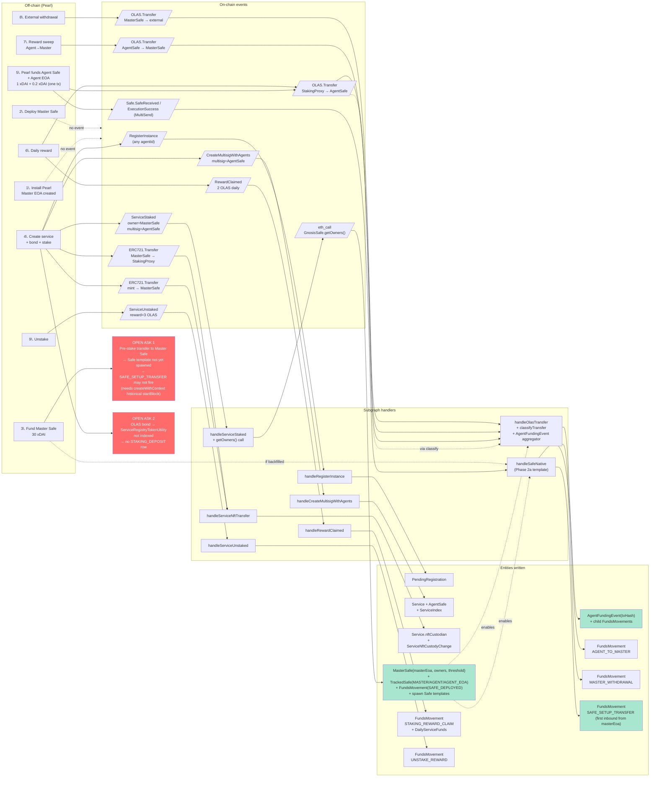
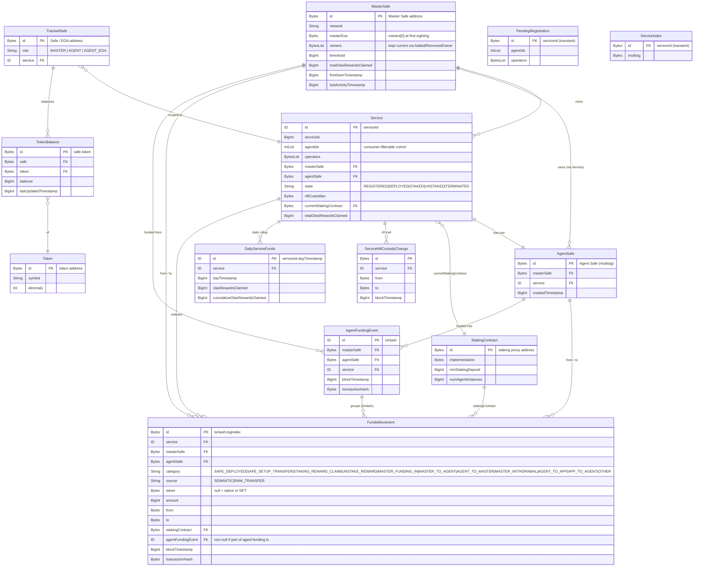
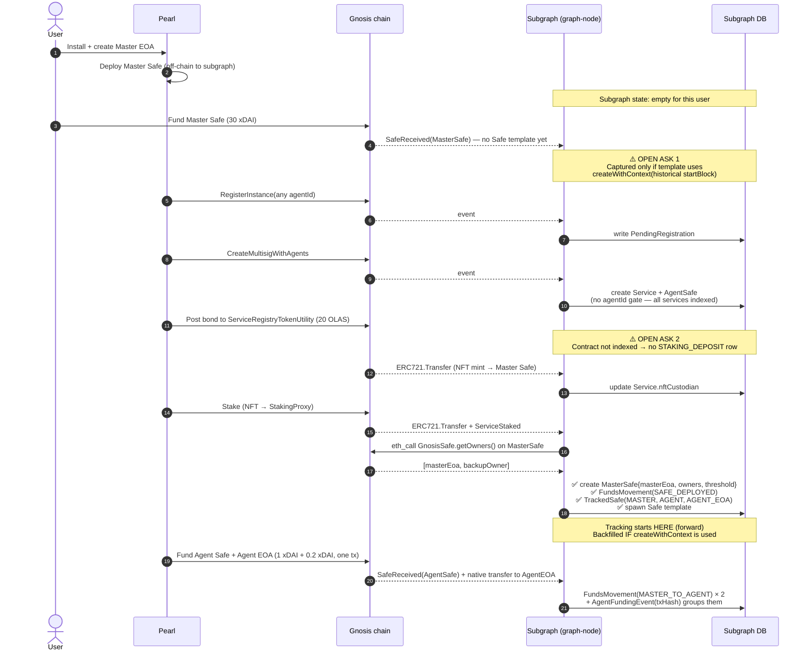

# Transaction History (VLOP-73)

Per-chain ledger view inside Pearl Wallet. Source: the proposed pearl-transactions subgraph ([PR #129](https://github.com/valory-xyz/autonolas-subgraph-studio/pull/129), currently plan-only). Mirrors the rewards-history stack: Service (GraphQL) → Hook (React Query) → Component.

Linear: [VLOP-73](https://linear.app/valory-xyz/issue/VLOP-73).

## Scope (v1)

All Pearl agent types on **Gnosis, Polygon, Optimism, Base** (Mode is deprecated, not deployed). Per @Tanya-atatakai's [review](https://github.com/valory-xyz/autonolas-subgraph-studio/pull/129#pullrequestreview-4356427623), the subgraph drops the `agentId` allowlist and indexes all services from `ServiceRegistryL2`; consumers filter by Pearl agent IDs at query time. So PredictTrader, Polystrat, Modius (after deprecation-revisit), Optimus, AgentsFun, PettAi all get history on the chains they run on.

Acceptance criteria from VLOP-73:

- Pearl wallet shows Master Safe balance + history per chain
- Pre-Safe wallet (no Master Safe yet on selected chain) shows EOA only, **no history tab**
- First post-Safe entry is "Setup complete"
- Confirmed txs only; chronological; no filtering; token amount as primary value
- Subgraph-lag indicator when indexing is behind

## UI integration point

`frontend/components/PearlWallet/` is step-based (`PearlWallet.tsx:47-67`). The `PEARL_WALLET_SCREEN` step renders `BalancesAndAssets.tsx`. Plan:

- Convert `BalancesAndAssets` content into a 2-tab layout: **Balances** | **History**.
- Tabs only render when `masterSafeAddress` is defined for the selected chain (`PearlWalletProvider.tsx:191-194` already derives this). When null → render existing EOA-only balances view, no tabs, no History tab.
- Chain switching stays on the existing `Segmented` control (`BalancesAndAssets.tsx:140-159`). The History tab re-keys its query on `walletChainId`.
- For a chain with no Pearl service yet (e.g. user has only run PredictTrader, then switches to Base before deploying AgentsFun) — empty-state copy "No transactions yet."

## Data flow

```
pearl-transactions subgraph (Gnosis | Polygon | Optimism | Base)
  └── TransactionHistoryService (graphql-request, gql query + Zod parse)
        └── useTransactionHistory(chainId, masterSafeAddress)
              ├── useTransactionHistoryByMonth (group + sort transformer)
              └── useSubgraphLag (queries _meta, returns stale flag)
                    └── <HistoryTab /> in BalancesAndAssets
```

## New files

| File | Purpose |
|---|---|
| `frontend/types/TransactionHistory.ts` | Zod schemas: `FundsMovement`, `AgentFundingEvent`, `FundsCategory` enum, `Meta`. Mirror `Autonolas.ts` |
| `frontend/service/TransactionHistory.ts` | `graphql-request` queries (`getTransactionHistory`, `getMeta`). Mirror `service/FundRecovery.ts` |
| `frontend/hooks/useTransactionHistory.ts` | `useQuery` keyed `['transactionHistory', chainId, masterSafe]`; transformer to categorized + month-grouped rows |
| `frontend/hooks/useSubgraphLag.ts` | Lag detector: `latestL1Block - _meta.block.number > LAG_THRESHOLD_BLOCKS` |
| `frontend/components/PearlWallet/History/` | `HistoryTab.tsx`, `HistoryRow.tsx`, `MonthGroup.tsx`, `StaleIndicator.tsx`, `EmptyState.tsx` |

## Touched files

| File | Change |
|---|---|
| `frontend/constants/urls.ts` | Add `TRANSACTION_HISTORY_SUBGRAPH_URLS_BY_EVM_CHAIN` for Gnosis + Polygon + Optimism + Base |
| `frontend/constants/reactQueryKeys.ts` | Add `TRANSACTION_HISTORY_KEY`, `SUBGRAPH_LAG_KEY` |
| `frontend/constants/intervals.ts` | Add `TRANSACTION_HISTORY_REFETCH_INTERVAL` (15s candidate) |
| `frontend/components/PearlWallet/Withdraw/BalancesAndAssets/BalancesAndAssets.tsx` | Wrap content in tabs when `masterSafeAddress` truthy |
| `frontend/components/PearlWallet/types.ts` | No change (steps unchanged) |

## Subgraph → UI category mapping

VLOP-73's 7 displayed entry types map to subgraph categories/entities:

| UI label | Subgraph source |
|---|---|
| "Setup complete" | `FundsMovement.category = SAFE_DEPLOYED` (emitted on first sighting of a Master Safe — see open Q on pre-stake) |
| "Deposit" | `FundsMovement.category = MASTER_FUNDING_IN` (inbound from non-`masterEoa` addresses) |
| "Funded \<agent\>: \<amount\> \<token\>" | `AgentFundingEvent` entity (one per `txHash`, lists constituent `FundsMovement`s — collapses multi-token + AgentSafe/AgentEOA in one tx server-side) |
| "Withdrawal from \<agent\>" | `FundsMovement.category = AGENT_TO_MASTER` |
| "Withdrawal to external wallet" | `FundsMovement.category = MASTER_WITHDRAWAL` |
| "OLAS staking" | **Still open** — see Q3. Best-case: `STAKING_DEPOSIT` synthesized at `ServiceStaked` using `minStakingDeposit × numAgentInstances` |
| "OLAS unstaking" | `FundsMovement.category = UNSTAKE_REWARD` (Phase 1) |
| (excluded from UI) | `STAKING_REWARD_CLAIM`, `SERVICE_EVICTED` |

The "Setup complete" anchor uses Tanya's proposed `SAFE_SETUP_TRANSFER` category (first inbound from `masterEoa`) IF the subgraph adopts historical-startBlock template spawning per our remaining open ask. Otherwise the row anchors on `SAFE_DEPLOYED` (which only marks Safe sighting, no amount).

Frontend filter on `source = RAW_TRANSFER` for funding rows to avoid the semantic/raw double-count on `STAKING_REWARD_CLAIM` rows that Phase 2a reconciles.

## Query shape (proposed)

```graphql
query GetTransactionHistory($masterSafe: Bytes!, $first: Int!, $skip: Int!) {
  masterSafe(id: $masterSafe) {
    id
    masterEoa
    owners
    threshold
  }
  fundsMovements(
    where: {
      masterSafe: $masterSafe
      category_in: [
        SAFE_DEPLOYED, SAFE_SETUP_TRANSFER, MASTER_FUNDING_IN,
        AGENT_TO_MASTER, MASTER_WITHDRAWAL, UNSTAKE_REWARD
      ]
    }
    orderBy: blockTimestamp
    orderDirection: desc
    first: $first
    skip: $skip
  ) {
    id
    category
    source
    token
    amount
    from
    to
    blockTimestamp
    transactionHash
  }
  agentFundingEvents(
    where: { masterSafe: $masterSafe }
    orderBy: blockTimestamp
    orderDirection: desc
    first: $first
    skip: $skip
  ) {
    id
    blockTimestamp
    transactionHash
    agentSafe { id service { id agentIds } }
    transfers { token amount from to }
  }
  _meta { block { number timestamp } hasIndexingErrors }
}
```

Two lists merged client-side into one chronological stream. Pagination: cursor by `blockTimestamp_lt` rather than `skip` once history grows. v1 uses `first: 100, skip: 0` — adequate per "history scope: from Pearl install onwards".

## Agent identification for the "Funded \<agent\>" label

`AgentFundingEvent.agentSafe.service.id` (subgraph) ↔ `chain_data.token` (frontend `Service` type, `frontend/types/Service.ts:59`) ↔ `serviceConfigId`. Lookup `agentType` from `ServicesProvider` by matching `chain_data.multisig === agentSafe.id`. Resolves to a display name via `AGENT_CONFIG[agentType].displayName`.

## Subgraph-lag indicator

`useSubgraphLag` returns `{ isStale: boolean, lagBlocks: number }`. Polls `_meta` every 30s. `isStale` when `lagBlocks > 50` (Gnosis ≈ 4 min, Polygon ≈ 2 min). Renders inline banner above the list: "Refresh in progress…". Reuses no existing pattern — none exists today.

## Pre-Safe state

Reuse existing `masterSafeAddress` null check (`PearlWalletProvider.tsx:191-194`). When null:

- Tabs not rendered (only Balances content shown)
- `useTransactionHistory` not called (gated by `enabled: !!masterSafeAddress`)

## Token amount rendering

VLOP-73: "Primary value: token amount only" (no USD). Use existing `TokenAmount` formatting from `@/components/ui` if present, else `formatUnits(amount, decimals)` with token lookup via `TOKEN_CONFIG[chainId][symbol]` (`frontend/config/tokens.ts`). Token symbol resolved by matching `FundsMovement.token` address against `TOKEN_CONFIG[chainId]`.

For native transfers (Phase 2a `Safe.SafeReceived` / `ExecutionSuccess`) the subgraph's `token` field will be `null` or zero address — render as chain-native (xDAI / POL).

## Testing

Per `frontend/tests/TEST_PLAN.md` conventions:

- `service/TransactionHistory.test.ts` — mock `graphql-request`, assert query/variables, Zod parse coverage
- `hooks/useTransactionHistory.test.ts` — categorization, month grouping, sort order, empty state
- `hooks/useSubgraphLag.test.ts` — stale threshold transitions
- `components/PearlWallet/History/HistoryTab.test.tsx` — render states (loading, empty, populated, stale, pre-Safe), tab gating, chain switch refetch
- Add to `tests/helpers/factories.ts`: `makeFundsMovement`, `makeMetaResponse` — all hex via existing address factories

## Phasing

1. **Phase 1** — types + service + hook + subgraph URLs. No UI. Tests.
2. **Phase 2** — `HistoryTab` + tab wrapping inside `BalancesAndAssets`. Tests.
3. **Phase 3** — lag indicator + empty/error states polish. Tests.
4. **Phase 4** — multi-instance support (post-VLOP-73 if `lastSelectedServiceConfigId` lands first; see `docs/features/multi-instance-agents.md`).

Each phase = separate PR, with `/review-implementation` between.

## Dependencies

- **Blocker:** [pearl-transactions subgraph PR #129](https://github.com/valory-xyz/autonolas-subgraph-studio/pull/129) must merge AND Studio deployments must exist for Gnosis, Polygon, Optimism, Base before any frontend code can integrate. Plan PR has no code yet.
- **Subgraph review state:** Tanya's [review](https://github.com/valory-xyz/autonolas-subgraph-studio/pull/129#pullrequestreview-4356427623) (drop agent-ID gate, derive `masterEoa`, add `SAFE_DEPLOYED`/`SAFE_SETUP_TRANSFER`, `AgentFundingEvent`, networks extension, Phase 2b product framing) is the source of truth this doc tracks.
- **Our remaining asks** in [issuecomment-4533199835](https://github.com/valory-xyz/autonolas-subgraph-studio/pull/129#issuecomment-4533199835): pre-stake transfer capture, OLAS staking bond visibility. Open questions 1 & 2 below mirror these.

## Subgraph data pipeline (visual)

Reflects Tanya's accepted changes: no `agentId` gate; Master EOA derived via `getOwners()`; `AgentFundingEvent` aggregation; `SAFE_DEPLOYED` / `SAFE_SETUP_TRANSFER` categories. Red = the two remaining open asks.



## Entity shapes

Reflects Tanya's accepted additions: `masterEoa` / `owners` / `threshold` on `MasterSafe`; `AgentFundingEvent` aggregator; expanded `FundsCategory` and `TrackedSafe.role` enums.



## Temporal ordering — what still needs the subgraph's help

Sequence view assuming Tanya's review is adopted. Only the pre-stake transfer (Open Ask 1) and the OLAS bond (Open Ask 2) remain unresolved.



## Open questions

1. **OLAS staking entry source.** No on-chain event surfaces the staking bond — it moves through `ServiceRegistryTokenUtility` which isn't indexed. Per our [open ask 2](https://github.com/valory-xyz/autonolas-subgraph-studio/pull/129#issuecomment-4533199835), options: (a) subgraph synthesizes `STAKING_DEPOSIT` at `ServiceStaked` using `minStakingDeposit × numAgentInstances`, (b) subgraph indexes `ServiceRegistryTokenUtility`, (c) UI skips the entry. Awaiting subgraph response.
2. **Pre-stake "Setup complete" anchor.** Per our [open ask 1](https://github.com/valory-xyz/autonolas-subgraph-studio/pull/129#issuecomment-4533199835), `SAFE_SETUP_TRANSFER` requires the `Safe` template to spawn with a historical `startBlock` (`createWithContext`) so the pre-stake xDAI funding is captured. If not adopted, "Setup complete" can only anchor on `SAFE_DEPLOYED` (no amount) — confirm with design whether that's acceptable.
3. **Stablecoin data path (Phase 2b).** Per Tanya's product-impact framing of §6.3: Polystrat is USDC/USDC.e-denominated, so if 2b is punted off-chain (Dune/RPC), the Polygon wallet view cannot satisfy *"Each included transaction type renders correctly"* without a second data source. Needs product decision before frontend work proceeds for Polygon.
4. **Multi-instance interaction.** Per `docs/features/multi-instance-agents.md`, services are migrating to per-service selection. History keyed on Master Safe is per-chain, not per-service — multi-instance doesn't break v1, but if user wants per-agent-instance history, that's a v2.
5. **Lag threshold values.** 50 blocks proposed for both chains. Confirm with backend/DevOps what's realistic for each of Gnosis/Polygon/Optimism/Base (different block times).
6. **Pagination strategy.** v1 ships `first: 100, skip: 0` (matches rewards-history precedent). Cursor pagination by `blockTimestamp_lt` is the right call long-term; confirm scope here.
