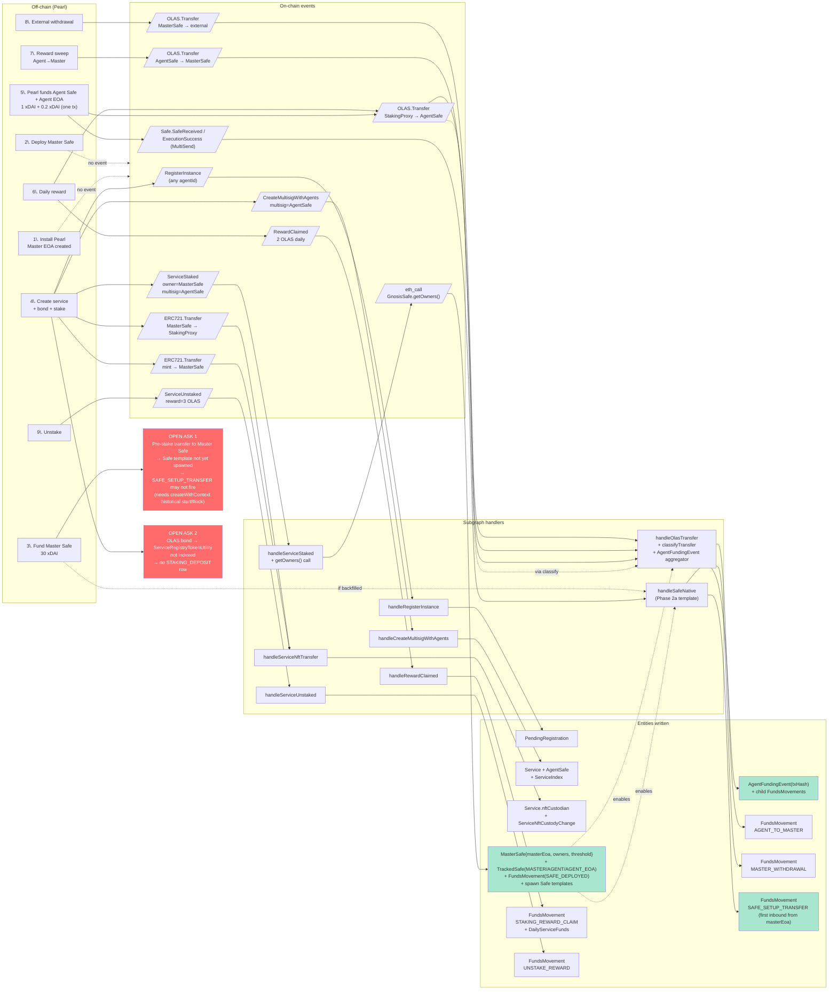
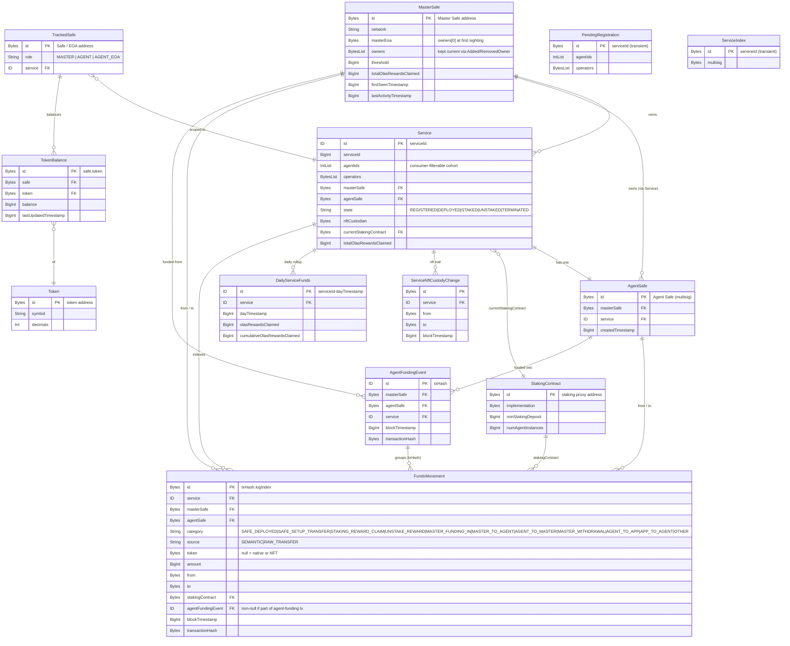
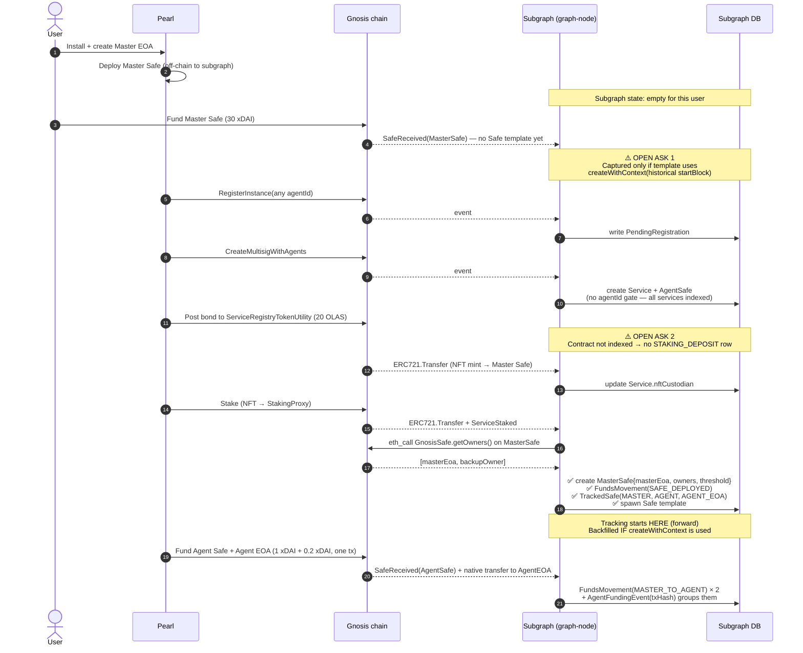

# Transaction History (VLOP-73)

Per-chain ledger view inside Pearl Wallet and the Agent Wallet. Source: the pearl-transactions indexer — graph-node subgraphs for Gnosis/Optimism/Base ([autonolas-subgraph-studio](https://github.com/valory-xyz/autonolas-subgraph-studio/tree/main/subgraphs/pearl-transactions)) and an SQD squid for Polygon ([autonolas-subgraph](https://github.com/valory-xyz/autonolas-subgraph/tree/main/squids/pearl-transactions)). Mirrors the rewards-history stack: Service (GraphQL) → Hook (React Query) → Component. Shipped on all four chains; sections marked *(as shipped)* are current, the rest is the original plan kept for history.

Linear: [VLOP-73](https://linear.app/valory-xyz/issue/VLOP-73).

## Scope (v1)

All Pearl agent types on **Gnosis, Polygon, Optimism, Base** (Mode is deprecated, not deployed). Per @Tanya-atatakai's [review](https://github.com/valory-xyz/autonolas-subgraph-studio/pull/129#pullrequestreview-4356427623), the subgraph drops the `agentId` allowlist and indexes all services from `ServiceRegistryL2`; consumers filter by Pearl agent IDs at query time. So PredictTrader, Polystrat, Modius (after deprecation-revisit), Optimus, AgentsFun, PettAi all get history on the chains they run on.

Acceptance criteria from VLOP-73:

- Pearl wallet shows Master Safe balance + history per chain
- Pre-Safe wallet (no Master Safe yet on selected chain) shows EOA only, **no history tab**
- First post-Safe entry is "Setup complete"
- Confirmed txs only; chronological; no filtering; token amount as primary value
- Subgraph-lag indicator when indexing is behind

## UI integration point

`frontend/components/PearlWallet/` is step-based (`PearlWallet.tsx:47-67`). The `PEARL_WALLET_SCREEN` step renders `BalancesAndAssets.tsx`. Plan:

- Convert `BalancesAndAssets` content into a 2-tab layout: **Balances** | **History**.
- Tabs only render when `masterSafeAddress` is defined for the selected chain (`PearlWalletProvider.tsx:191-194` already derives this). When null → render existing EOA-only balances view, no tabs, no History tab.
- Chain switching stays on the existing `Segmented` control (`BalancesAndAssets.tsx:140-159`). The History tab re-keys its query on `walletChainId`.
- For a chain with no Pearl service yet (e.g. user has only run PredictTrader, then switches to Base before deploying AgentsFun) — empty-state copy "No transactions yet."

## Data flow (as shipped)

```
pearl-transactions — graph-node: Gnosis v1 | Optimism v1 | Base v2 — SQD squid: Polygon sqd
  └── TransactionHistoryService / AgentTransactionHistoryService
        (graphql-request; per-revision document + Zod schema + normalizer → v1-shaped domain)
        └── useTransactionHistory / useAgentTransactionHistory (React Query, 15-min refetch)
              ├── row building (group by tx + category, AgentFundingEvent dedup, sweep hiding)
              └── computeIsDataDelayed(_meta) → isDataDelayed
                    └── <TransactionHistoryView /> — shared shell (states, Load more, stale banner)
                          rendered by <TransactionHistory /> (Pearl Wallet BalancesAndAssets)
                          and <AgentTransactionHistory /> (Agent Wallet BalancesAndAssets)
```

## Schema revisions (v1 / v2 / sqd)

Live deployments serve three incompatible revisions: Gnosis/Optimism proxies pin subgraph **v0.0.6 (v1)**, Base pins **v0.0.7 (v2)** — its indexers no longer serve v0.0.6 — and Polygon is served by the **SQD squid (sqd)** at `autonolas-subgraph/squids/pearl-transactions` (OPE-1905; the graph-node Polygon deployment indexed too slowly to be usable, see the squid's `MIGRATION.md`). Differences (verified against the live Base deployment and the live Polygon squid, not READMEs):

| | v1 (v0.0.6) | v2 (v0.0.7) | sqd (squid) |
|---|---|---|---|
| Bond rows | `fundsMovements` with `bondType` | separate `bondMovements` ledger (carries `bondType`) | as v2 |
| OLAS reward sweeps | `AGENT_TO_MASTER`, hidden client-side (`isOlasAgentToMaster`) | pre-split `AGENT_OLAS_TO_MASTER`, excluded by the query's category filter | as v2 |
| `Service.id` | numeric string | registry Bytes (`"0x7802"`); numeric id in new `serviceId` field | numeric string; `serviceId` also present |
| Query dialect | Graph | Graph | **OpenReader**: `limit`/`offset`, `orderBy: x_DESC`, relation filters `{ id_eq }`, singular `masterSafeById`, `String!` ids |
| Indexer head | `_meta { block { number timestamp } hasIndexingErrors }` | as v1 | no `_meta`; `indexerStatusById(id: "1") { blockNumber blockTimestamp }` singleton, BigInt strings |

Mechanism: `TRANSACTION_HISTORY_SUBGRAPH_SCHEMA_BY_EVM_CHAIN` (`frontend/constants/urls.ts`) maps chain → revision (absent = v1). Both services pick the matching query document, Zod-parse with the matching schema, and — for v2/sqd — normalize to the v1-shaped domain types via `normalize*V2` / `normalize*Sqd` in `frontend/utils/transactionHistory.ts` (bond rows merged into `fundsMovements`, sweep rows dropped, `service.id` mapped from `serviceId`). Hooks and components are revision-agnostic.

The sqd revision is deliberately thin: its query documents alias `masterSafeById` → `masterSafe` and `indexerStatusById` → `indexerStatus`, so the response wrapper matches v2 apart from meta. Its Zod schemas are `*V2Schema.omit({ _meta }).extend({ indexerStatus })`, and its normalizer maps `IndexerStatus → SubgraphMeta` (`hasIndexingErrors` synthesised `false`) then delegates to the v2 normalizer — so `computeIsDataDelayed` is untouched. The `first`/`skip` params on `get`/`getAll` are kept for all revisions; the sqd branch maps them to `limit`/`offset` internally. Polygon's URL is path-style (`…/squid/transactions-polygon/graphql`) rather than a `transactions-<chain>.` host — that difference is deliberate, not a typo.

## Files (as shipped)

| File | Purpose |
|---|---|
| `frontend/types/TransactionHistory.ts` | Zod schemas per revision (v1 domain, v2 raw, sqd raw), `FundsCategory`, `SubgraphMeta`, `IndexerStatus`, `TransactionHistoryRow` |
| `frontend/service/TransactionHistory.ts`, `AgentTransactionHistory.ts` | one query document per revision; `get` (one page) and `getAll` (page loop, `PAGE_SIZE` 1000, `MAX_PAGES` 1) |
| `frontend/utils/transactionHistory.ts` | `isOlasAgentToMaster`, `computeIsDataDelayed`, `normalize*V2`, `normalize*Sqd`, `indexerStatusToSubgraphMeta` |
| `frontend/hooks/useTransactionHistory.ts`, `useAgentTransactionHistory.ts` | React Query wiring + row building; expose `rows`, `isDataDelayed`, `isUnavailable`, etc. |
| `frontend/components/PearlWallet/History/` | `TransactionHistory.tsx`, `TransactionHistoryView.tsx` (shared shell), `TransactionHistoryRow.tsx`, `TransactionRowIcon.tsx`, `labels.ts`, `tokenLookup.ts`, `useAgentLookupBySafe.ts`, `agentByAgentId.ts` |
| `frontend/components/AgentWallet/BalancesAndAssets/AgentTransactionHistory.tsx`, `agentTransactionLabels.ts` | agent-perspective wrapper + perspective-flipped labels/icons |

There is no month grouping, no separate lag hook, and no per-chain tab component — history is a section inside the existing Balances screen, keyed on the wallet's selected chain.

## Touched files

| File | Change |
|---|---|
| `frontend/constants/urls.ts` | Add `TRANSACTION_HISTORY_SUBGRAPH_URLS_BY_EVM_CHAIN` for Gnosis + Polygon + Optimism + Base |
| `frontend/constants/reactQueryKeys.ts` | Add `TRANSACTION_HISTORY_KEY`, `SUBGRAPH_LAG_KEY` |
| `frontend/constants/intervals.ts` | Add `TRANSACTION_HISTORY_REFETCH_INTERVAL` (15s candidate) |
| `frontend/components/PearlWallet/Withdraw/BalancesAndAssets/BalancesAndAssets.tsx` | Wrap content in tabs when `masterSafeAddress` truthy |
| `frontend/components/PearlWallet/types.ts` | No change (steps unchanged) |

## Subgraph → UI category mapping

VLOP-73's 7 displayed entry types map to subgraph categories/entities:

| UI label | Subgraph source |
|---|---|
| "Setup complete" | `FundsMovement.category = SAFE_DEPLOYED` (emitted on first sighting of a Master Safe — see open Q on pre-stake) |
| "Deposit" | `FundsMovement.category = MASTER_FUNDING_IN` (inbound from non-`masterEoa` addresses) |
| "Funded \<agent\>: \<amount\> \<token\>" | `AgentFundingEvent` entity (one per `txHash`, lists constituent `FundsMovement`s — collapses multi-token + AgentSafe/AgentEOA in one tx server-side) |
| "Withdrawal from \<agent\>" | `FundsMovement.category = AGENT_TO_MASTER` |
| "Withdrawal to external wallet" | `FundsMovement.category = MASTER_WITHDRAWAL` |
| "OLAS staking" | **Still open** — see Q3. Best-case: `STAKING_DEPOSIT` synthesized at `ServiceStaked` using `minStakingDeposit × numAgentInstances` |
| "OLAS unstaking" | `FundsMovement.category = UNSTAKE_REWARD` (Phase 1) |
| (excluded from UI) | `STAKING_REWARD_CLAIM`, `SERVICE_EVICTED` |

The "Setup complete" anchor uses Tanya's proposed `SAFE_SETUP_TRANSFER` category (first inbound from `masterEoa`) IF the subgraph adopts historical-startBlock template spawning per our remaining open ask. Otherwise the row anchors on `SAFE_DEPLOYED` (which only marks Safe sighting, no amount).

Frontend filter on `source = RAW_TRANSFER` for funding rows to avoid the semantic/raw double-count on `STAKING_REWARD_CLAIM` rows that Phase 2a reconciles.

## Query shape (proposed)

```graphql
query GetTransactionHistory($masterSafe: Bytes!, $first: Int!, $skip: Int!) {
  masterSafe(id: $masterSafe) {
    id
    masterEoa
    owners
    threshold
  }
  fundsMovements(
    where: {
      masterSafe: $masterSafe
      category_in: [
        SAFE_DEPLOYED, SAFE_SETUP_TRANSFER, MASTER_FUNDING_IN,
        AGENT_TO_MASTER, MASTER_WITHDRAWAL, UNSTAKE_REWARD
      ]
    }
    orderBy: blockTimestamp
    orderDirection: desc
    first: $first
    skip: $skip
  ) {
    id
    category
    source
    token
    amount
    from
    to
    blockTimestamp
    transactionHash
  }
  agentFundingEvents(
    where: { masterSafe: $masterSafe }
    orderBy: blockTimestamp
    orderDirection: desc
    first: $first
    skip: $skip
  ) {
    id
    blockTimestamp
    transactionHash
    agentSafe { id service { id agentIds } }
    transfers { token amount from to }
  }
  _meta { block { number timestamp } hasIndexingErrors }
}
```

Two lists merged client-side into one chronological stream. Pagination: cursor by `blockTimestamp_lt` rather than `skip` once history grows. v1 uses `first: 100, skip: 0` — adequate per "history scope: from Pearl install onwards".

## Agent identification for the "Funded \<agent\>" label

`AgentFundingEvent.agentSafe.service.id` (subgraph) ↔ `chain_data.token` (frontend `Service` type, `frontend/types/Service.ts:59`) ↔ `serviceConfigId`. Lookup `agentType` from `ServicesProvider` by matching `chain_data.multisig === agentSafe.id`. Resolves to a display name via `AGENT_CONFIG[agentType].displayName`.

## Stale-data indicator (as shipped)

No separate lag hook. `computeIsDataDelayed(meta)` (`frontend/utils/transactionHistory.ts`) returns true when the indexed block's **timestamp** is ≥12h behind wall-clock; each hook exposes it as `isDataDelayed`, and `TransactionHistoryView` renders the `DataDelayAlert` above the rows — message "Recent transactions may not appear yet", description "Wallet operations work normally. This usually resolves on its own." It shows only alongside actual history, never in the loading / error / empty / unavailable states. On v1/v2 the timestamp is `_meta.block.timestamp`; on sqd it comes from the squid's `IndexerStatus` singleton mapped into the same `SubgraphMeta` shape, so the helper is revision-agnostic.

## Pre-Safe state

Reuse existing `masterSafeAddress` null check (`PearlWalletProvider.tsx:191-194`). When null:

- Tabs not rendered (only Balances content shown)
- `useTransactionHistory` not called (gated by `enabled: !!masterSafeAddress`)

## Token amount rendering

VLOP-73: "Primary value: token amount only" (no USD). Use existing `TokenAmount` formatting from `@/components/ui` if present, else `formatUnits(amount, decimals)` with token lookup via `TOKEN_CONFIG[chainId][symbol]` (`frontend/config/tokens.ts`). Token symbol resolved by matching `FundsMovement.token` address against `TOKEN_CONFIG[chainId]`.

For native transfers (Phase 2a `Safe.SafeReceived` / `ExecutionSuccess`) the subgraph's `token` field will be `null` or zero address — render as chain-native (xDAI / POL).

## Testing (as shipped)

Per `frontend/tests/TEST_PLAN.md` conventions, under `frontend/tests/`:

- `service/TransactionHistory.test.ts`, `service/AgentTransactionHistory.test.ts` — `graphql-request` mocked; per-revision query/variable assertions (incl. absence of the other dialect's args), Zod rejection of the wrong shape, `getAll` paging
- `utils/transactionHistory.test.ts` — `isOlasAgentToMaster`, `computeIsDataDelayed`, the v2/sqd normalizers and `indexerStatusToSubgraphMeta`
- `hooks/useTransactionHistory.test.ts`, `hooks/useAgentTransactionHistory.test.ts` — row building, grouping, sweep hiding, delayed flag, unavailable gating
- `components/PearlWallet/History/TransactionHistory.test.tsx`, `labels.test.ts`, `tokenLookup.test.ts`; `components/AgentWallet/BalancesAndAssets/agentTransactionLabels.test.ts` — render states and label/token resolution with the hook mocked
- `components/PearlWallet/History/TransactionHistory.sqdReplay.test.tsx` — replays a captured live Polygon squid response through the unmocked service → normalizer → hook → view, for both wallets, including the stale-banner case
- Factories in `tests/helpers/factories.ts`: `makeFundsMovement`, `makeSubgraphMeta`, `make*V2`, `makeIndexerStatus`, `make*Sqd`

## Phasing (history)

Shipped as planned: types/service/hook (VLOP-73), the history section inside `BalancesAndAssets` and the stale banner, then the Agent Wallet view (OPE-1773), Optimism, Base (v2 revision) and Polygon via SQD (OPE-1905). Multi-instance interaction remains as noted under Open questions.

## Dependencies

- **Blocker:** [pearl-transactions subgraph PR #129](https://github.com/valory-xyz/autonolas-subgraph-studio/pull/129) must merge AND Studio deployments must exist for Gnosis, Polygon, Optimism, Base before any frontend code can integrate. Plan PR has no code yet.
- **Subgraph review state:** Tanya's [review](https://github.com/valory-xyz/autonolas-subgraph-studio/pull/129#pullrequestreview-4356427623) (drop agent-ID gate, derive `masterEoa`, add `SAFE_DEPLOYED`/`SAFE_SETUP_TRANSFER`, `AgentFundingEvent`, networks extension, Phase 2b product framing) is the source of truth this doc tracks.
- **Our remaining asks** in [issuecomment-4533199835](https://github.com/valory-xyz/autonolas-subgraph-studio/pull/129#issuecomment-4533199835): pre-stake transfer capture, OLAS staking bond visibility. Open questions 1 & 2 below mirror these.

## Subgraph data pipeline (visual)

Reflects Tanya's accepted changes: no `agentId` gate; Master EOA derived via `getOwners()`; `AgentFundingEvent` aggregation; `SAFE_DEPLOYED` / `SAFE_SETUP_TRANSFER` categories. Red = the two remaining open asks.


```mermaid
flowchart LR
    subgraph OFF["Off-chain (Pearl)"]
        U1["1\. Install Pearl<br/>Master EOA created"]
        U2["2\. Deploy Master Safe"]
        U3["3\. Fund Master Safe<br/>30 xDAI"]
        U4["4\. Create service<br/>+ bond + stake"]
        U5["5\. Pearl funds Agent Safe + Agent EOA<br/>1 xDAI + 0.2 xDAI (one tx)"]
        U6["6\. Daily reward"]
        U7["7\. Reward sweep<br/>Agent→Master"]
        U8["8\. External withdrawal"]
        U9["9\. Unstake"]
    end

    subgraph CHAIN["On-chain events"]
        E1[/"RegisterInstance<br/>(any agentId)"/]
        E2[/"CreateMultisigWithAgents<br/>multisig=AgentSafe"/]
        E3[/"ERC721.Transfer<br/>mint → MasterSafe"/]
        E4[/"ERC721.Transfer<br/>MasterSafe → StakingProxy"/]
        E5[/"ServiceStaked<br/>owner=MasterSafe<br/>multisig=AgentSafe"/]
        ECALL[/"eth_call<br/>GnosisSafe.getOwners()"/]
        E6[/"Safe.SafeReceived /<br/>ExecutionSuccess (MultiSend)"/]
        E7[/"OLAS.Transfer<br/>StakingProxy → AgentSafe"/]
        E8[/"OLAS.Transfer<br/>AgentSafe → MasterSafe"/]
        E9[/"OLAS.Transfer<br/>MasterSafe → external"/]
        E10[/"ServiceUnstaked<br/>reward=3 OLAS"/]
        E11[/"RewardClaimed<br/>2 OLAS daily"/]
    end

    subgraph HND["Subgraph handlers"]
        H1["handleRegisterInstance"]
        H2["handleCreateMultisigWithAgents"]
        H3["handleServiceNftTransfer"]
        H4["handleServiceStaked<br/>+ getOwners() call"]
        H5["handleSafeNative<br/>(Phase 2a template)"]
        H6["handleOlasTransfer<br/>+ classifyTransfer<br/>+ AgentFundingEvent aggregator"]
        H7["handleRewardClaimed"]
        H8["handleServiceUnstaked"]
    end

    subgraph ENT["Entities written"]
        N1["PendingRegistration"]
        N2["Service + AgentSafe<br/>+ ServiceIndex"]
        N3["Service.nftCustodian<br/>+ ServiceNftCustodyChange"]
        N4["MasterSafe{masterEoa, owners, threshold}<br/>+ TrackedSafe(MASTER/AGENT/AGENT_EOA)<br/>+ FundsMovement(SAFE_DEPLOYED)<br/>+ spawn Safe templates"]
        N5["AgentFundingEvent(txHash)<br/>+ child FundsMovements"]
        N6["FundsMovement<br/>STAKING_REWARD_CLAIM<br/>+ DailyServiceFunds"]
        N7["FundsMovement<br/>AGENT_TO_MASTER"]
        N8["FundsMovement<br/>MASTER_WITHDRAWAL"]
        N9["FundsMovement<br/>UNSTAKE_REWARD"]
        N10["FundsMovement<br/>SAFE_SETUP_TRANSFER (first inbound from masterEoa)"]
    end

    GAP_A["OPEN ASK 1<br/>Pre-stake transfer to Master Safe<br/>→ Safe template not yet spawned<br/>→ SAFE_SETUP_TRANSFER may not fire<br/>(needs createWithContext historical startBlock)"]
    GAP_B["OPEN ASK 2<br/>OLAS bond → ServiceRegistryTokenUtility<br/>not indexed<br/>→ no STAKING_DEPOSIT row"]

    U1 -.no event.-> CHAIN
    U2 -.no event.-> CHAIN
    U3 --> GAP_A
    U4 --> E1 --> H1 --> N1
    U4 --> E2 --> H2 --> N2
    U4 --> E3 --> H3 --> N3
    U4 --> GAP_B
    U4 --> E4 --> H3
    U4 --> E5 --> H4
    H4 --> ECALL --> N4
    N4 -.enables.-> H5
    N4 -.enables.-> H6
    U5 --> E6 --> H5 --> N5
    U5 --> E7 -.via classify.-> H6
    U3 -.if backfilled.-> H5 --> N10
    U6 --> E11 --> H7 --> N6
    U6 --> E7 --> H6
    U7 --> E8 --> H6 --> N7
    U8 --> E9 --> H6 --> N8
    U9 --> E10 --> H8 --> N9

    style GAP_A fill:#ff6b6b,color:#fff
    style GAP_B fill:#ff6b6b,color:#fff
    style N4 fill:#a8e6cf
    style N5 fill:#a8e6cf
    style N10 fill:#a8e6cf
```

## Entity shapes

Reflects Tanya's accepted additions: `masterEoa` / `owners` / `threshold` on `MasterSafe`; `AgentFundingEvent` aggregator; expanded `FundsCategory` and `TrackedSafe.role` enums.


```mermaid
erDiagram
    MasterSafe ||--o{ Service : owns
    MasterSafe ||--o{ AgentSafe : "owns (via Service)"
    Service ||--|| AgentSafe : "has one"
    Service }o--|| StakingContract : "currentStakingContract"
    Service ||--o{ ServiceNftCustodyChange : "nft trail"
    Service ||--o{ DailyServiceFunds : "daily rollup"
    MasterSafe ||--o{ FundsMovement : "from / to"
    AgentSafe ||--o{ FundsMovement : "from / to"
    Service ||--o{ FundsMovement : "indexes"
    StakingContract ||--o{ FundsMovement : "stakingContract"
    AgentFundingEvent ||--o{ FundsMovement : "groups (txHash)"
    MasterSafe ||--o{ AgentFundingEvent : "funded from"
    AgentSafe ||--o{ AgentFundingEvent : "funded into"
    TrackedSafe }o--|| Service : "scoped to"
    TokenBalance }o--|| Token : "of"
    TrackedSafe ||--o{ TokenBalance : "balances"

    MasterSafe {
        Bytes id PK "Master Safe address"
        String network
        Bytes masterEoa "owners[0] at first sighting"
        BytesList owners "kept current via Added/RemovedOwner"
        BigInt threshold
        BigInt totalOlasRewardsClaimed
        BigInt firstSeenTimestamp
        BigInt lastActivityTimestamp
    }
    AgentSafe {
        Bytes id PK "Agent Safe (multisig)"
        Bytes masterSafe FK
        ID service FK
        BigInt createdTimestamp
    }
    Service {
        ID id PK "serviceId"
        BigInt serviceId
        IntList agentIds "consumer-filterable cohort"
        BytesList operators
        Bytes masterSafe FK
        Bytes agentSafe FK
        String state "REGISTERED|DEPLOYED|STAKED|UNSTAKED|TERMINATED"
        Bytes nftCustodian
        Bytes currentStakingContract FK
        BigInt totalOlasRewardsClaimed
    }
    StakingContract {
        Bytes id PK "staking proxy address"
        Bytes implementation
        BigInt minStakingDeposit
        BigInt numAgentInstances
    }
    FundsMovement {
        Bytes id PK "txHash.logIndex"
        ID service FK
        Bytes masterSafe FK
        Bytes agentSafe FK
        String category "SAFE_DEPLOYED|SAFE_SETUP_TRANSFER|STAKING_REWARD_CLAIM|UNSTAKE_REWARD|MASTER_FUNDING_IN|MASTER_TO_AGENT|AGENT_TO_MASTER|MASTER_WITHDRAWAL|AGENT_TO_APP|APP_TO_AGENT|OTHER"
        String source "SEMANTIC|RAW_TRANSFER"
        Bytes token "null = native or NFT"
        BigInt amount
        Bytes from
        Bytes to
        Bytes stakingContract FK
        ID agentFundingEvent FK "non-null if part of agent-funding tx"
        BigInt blockTimestamp
        Bytes transactionHash
    }
    AgentFundingEvent {
        ID id PK "txHash"
        Bytes masterSafe FK
        Bytes agentSafe FK
        ID service FK
        BigInt blockTimestamp
        Bytes transactionHash
    }
    ServiceNftCustodyChange {
        Bytes id PK
        ID service FK
        Bytes from
        Bytes to
        BigInt blockTimestamp
    }
    DailyServiceFunds {
        ID id PK "serviceId-dayTimestamp"
        ID service FK
        BigInt dayTimestamp
        BigInt olasRewardsClaimed
        BigInt cumulativeOlasRewardsClaimed
    }
    Token {
        Bytes id PK "token address"
        String symbol
        Int decimals
    }
    TrackedSafe {
        Bytes id PK "Safe / EOA address"
        String role "MASTER | AGENT | AGENT_EOA"
        ID service FK
    }
    TokenBalance {
        Bytes id PK "safe.token"
        Bytes safe FK
        Bytes token FK
        BigInt balance
        BigInt lastUpdatedTimestamp
    }
    PendingRegistration {
        Bytes id PK "serviceId (transient)"
        IntList agentIds
        BytesList operators
    }
    ServiceIndex {
        Bytes id PK "serviceId (transient)"
        Bytes multisig
    }
```

## Temporal ordering — what still needs the subgraph's help

Sequence view assuming Tanya's review is adopted. Only the pre-stake transfer (Open Ask 1) and the OLAS bond (Open Ask 2) remain unresolved.


```mermaid
sequenceDiagram
    autonumber
    actor User
    participant Pearl
    participant Chain as Gnosis chain
    participant SG as Subgraph (graph-node)
    participant DB as Subgraph DB

    User->>Pearl: Install + create Master EOA
    Pearl->>Pearl: Deploy Master Safe (off-chain to subgraph)
    Note over SG,DB: Subgraph state: empty for this user

    User->>Chain: Fund Master Safe (30 xDAI)
    Chain-->>SG: SafeReceived(MasterSafe) — no Safe template yet
    Note over SG,DB: ⚠️ OPEN ASK 1<br/>Captured only if template uses<br/>createWithContext(historical startBlock)

    Pearl->>Chain: RegisterInstance(any agentId)
    Chain-->>SG: event
    SG->>DB: write PendingRegistration

    Pearl->>Chain: CreateMultisigWithAgents
    Chain-->>SG: event
    SG->>DB: create Service + AgentSafe<br/>(no agentId gate — all services indexed)

    Pearl->>Chain: Post bond to ServiceRegistryTokenUtility (20 OLAS)
    Note over SG,DB: ⚠️ OPEN ASK 2<br/>Contract not indexed → no STAKING_DEPOSIT row

    Chain-->>SG: ERC721.Transfer (NFT mint → Master Safe)
    SG->>DB: update Service.nftCustodian

    Pearl->>Chain: Stake (NFT → StakingProxy)
    Chain-->>SG: ERC721.Transfer + ServiceStaked
    SG->>Chain: eth_call GnosisSafe.getOwners() on MasterSafe
    Chain-->>SG: [masterEoa, backupOwner]
    SG->>DB: ✅ create MasterSafe{masterEoa, owners, threshold}<br/>✅ FundsMovement(SAFE_DEPLOYED)<br/>✅ TrackedSafe(MASTER, AGENT, AGENT_EOA)<br/>✅ spawn Safe template
    Note over SG,DB: Tracking starts HERE (forward)<br/>Backfilled IF createWithContext is used

    Pearl->>Chain: Fund Agent Safe + Agent EOA (1 xDAI + 0.2 xDAI, one tx)
    Chain-->>SG: SafeReceived(AgentSafe) + native transfer to AgentEOA
    SG->>DB: FundsMovement(MASTER_TO_AGENT) × 2<br/>+ AgentFundingEvent(txHash) groups them
```

## Open questions

Status as of the Polygon/SQD ship: 1 resolved (the indexer reads `ServiceRegistryTokenUtility`; bonds render as "\<agent\> stake" / "unstake"); 2 still open — `SAFE_SETUP_TRANSFER` is neither captured pre-discovery nor included in the wallet's category filter, so the first post-registration top-up is hidden on all revisions (follow-up ticket); 3 resolved (stablecoin transfers are indexed; pUSD renders on Polygon); 4 still open; 5 resolved — shipped as a 12h wall-clock threshold on the indexed block timestamp, not a block-count lag; 6 shipped as a single 1000-row page per list with `MAX_PAGES = 1` (an `id_ASC` tiebreaker is needed before paging deeper — follow-up ticket). Original text kept below.

1. **OLAS staking entry source.** No on-chain event surfaces the staking bond — it moves through `ServiceRegistryTokenUtility` which isn't indexed. Per our [open ask 2](https://github.com/valory-xyz/autonolas-subgraph-studio/pull/129#issuecomment-4533199835), options: (a) subgraph synthesizes `STAKING_DEPOSIT` at `ServiceStaked` using `minStakingDeposit × numAgentInstances`, (b) subgraph indexes `ServiceRegistryTokenUtility`, (c) UI skips the entry. Awaiting subgraph response.
2. **Pre-stake "Setup complete" anchor.** Per our [open ask 1](https://github.com/valory-xyz/autonolas-subgraph-studio/pull/129#issuecomment-4533199835), `SAFE_SETUP_TRANSFER` requires the `Safe` template to spawn with a historical `startBlock` (`createWithContext`) so the pre-stake xDAI funding is captured. If not adopted, "Setup complete" can only anchor on `SAFE_DEPLOYED` (no amount) — confirm with design whether that's acceptable.
3. **Stablecoin data path (Phase 2b).** Per Tanya's product-impact framing of §6.3: Polystrat is USDC/USDC.e-denominated, so if 2b is punted off-chain (Dune/RPC), the Polygon wallet view cannot satisfy *"Each included transaction type renders correctly"* without a second data source. Needs product decision before frontend work proceeds for Polygon.
4. **Multi-instance interaction.** Per `docs/features/multi-instance-agents.md`, services are migrating to per-service selection. History keyed on Master Safe is per-chain, not per-service — multi-instance doesn't break v1, but if user wants per-agent-instance history, that's a v2.
5. **Lag threshold values.** 50 blocks proposed for both chains. Confirm with backend/DevOps what's realistic for each of Gnosis/Polygon/Optimism/Base (different block times).
6. **Pagination strategy.** v1 ships `first: 100, skip: 0` (matches rewards-history precedent). Cursor pagination by `blockTimestamp_lt` is the right call long-term; confirm scope here.
